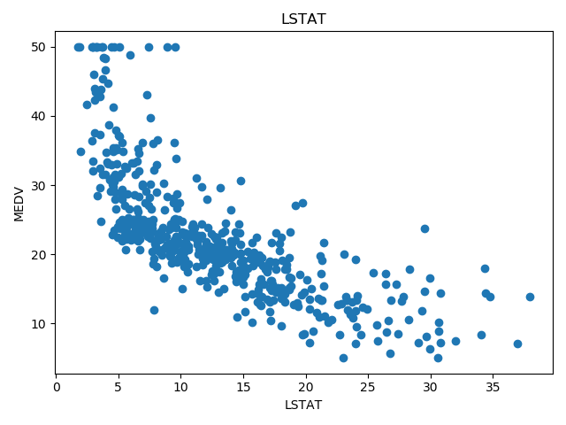
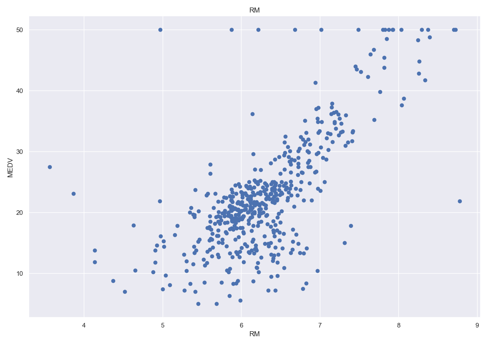

# Boston Housing
### Linear Regression
Linear Regression is a machine learning algorithm based on supervised learning. It performs a regression task. Regression models a target prediction value based on independent variables. It is mostly used for finding out the relationship between variables and forecasting.

### About the Dataset
We will use a housing dataset which contains information about different houses in Boston. This dataset is available in the _scikit-learn_ library. There are 506 samples and 13 feature variables in the dataset. The objective is to predict the value of the prices of the houses using the given features.

### Required Libraries
```python
import pandas as pd
import numpy as np
import matplotlib.pyplot as plt
import seaborn as sns
from sklearn.datasets import load_boston
```

### Exploratory Analysis
We perform exploratory analysis to derive useful information from the dataset. This step is useful as the quality of the dataset directly affects the ability of the model to learn.
```python
# Loading the dataset
boston_dataset = load_boston()

# Check values of boston_dataset
boston_dataset.keys()
```

When we print the above code, it returns
```
dict_keys(['data', 'target', 'feature_names', 'DESCR'])
```

Here,
1. _data_: contains the information for various houses
2. _target_: prices of the house
3. _feature_names_: names of the features
4. _DESCR_: describes the dataset

The description of all the features is given below:
```
CRIM: Per capita crime rate by town
ZN: Proportion of residential land zoned for lots over 25,000 sq. ft
INDUS: Proportion of non-retail business acres per town
CHAS: Charles River dummy variable (= 1 if tract bounds river; 0 otherwise)
NOX: Nitric oxide concentration (parts per 10 million)
RM: Average number of rooms per dwelling
AGE: Proportion of owner-occupied units built prior to 1940
DIS: Weighted distances to five Boston employment centers
RAD: Index of accessibility to radial highways
TAX: Full-value property tax rate per $10,000
PTRATIO: Pupil-teacher ratio by town
B: 1000(Bk — 0.63)², where Bk is the proportion of [people of African American descent] by town
LSTAT: Percentage of lower status of the population
MEDV: Median value of owner-occupied homes in $1000s
```

Now, we will use some visualizations to understand the relationship of the target variable with other features. We will use _displot_ function from the _seaborn_ library.
```python
sns.set(rc={
    'figure.figsize': (11.7, 8.27)
})
sns.distplot(boston['MEDV'], bins=30)
plt.show()
```

We see that the values of MEDV are distributed normally with few outliers.


Now, we will create a correlation matrix using _corr_ function from the pandas dataframe library. We will use heat-map function from the seaborn library to plot the correlation matrix.
```python
corr_matrix = boston.corr().round(2)
sns.heatmap(data=corr_matrix, annot=True)
plt.show()
```


The degree of association depends on the coefficient of correlation (r) which is also called as Pearson's correlation coefficient. This Pearson's correlation is the measure of linear association and it varies from +1 through 0 to -1. (+1, -1) shows the how much positive or negative correlation it has between two variables. 0 shows the absense of correlation between two relations.

### Observations for feature selection

* To fit a linear regression model, we select those features which have a high correlation with our target variable MEDV. By looking at the correlation matrix we can see that RM has a strong positive correlation with MEDV (0.7) where as LSTAT has a high negative correlation with MEDV(-0.74).
* An important point in selecting features for a linear regression model is to check for multi-co-linearity. The features RAD, TAX have a correlation of 0.91. These feature pairs are strongly correlated to each other. We should not select both these features together for training the model. Check this for an explanation. Same goes for the features DIS and AGE which have a correlation of -0.75.
* DIS with a correlation of 0.25 rises with plotted against MEDV and shows no increase later in the same graph. This provides an additional parameter to judge the prices of the house.

Based on the above observations we will RM and LSTAT as our features. Using a scatter plot let’s see how these features vary with MEDV.

```python
plt.scatter(boston['LSTAT'], boston['MEDV'], marker='o')
plt.title("LSTAT")
plt.xlabel('LSTAT')
plt.ylabel('MEDV')
plt.show()
```



```python
plt.scatter(boston['RM'], boston['MEDV'], marker='o')
plt.title("RM")
plt.xlabel('RM')
plt.ylabel('MEDV')
plt.show()
```



* The prices increase as the value of RM increases linearly. There are few outliers and the data seems to be capped at 50.
* The prices tend to decrease with an increase in LSTAT. Though it doesn’t look to be following exactly a linear line.

### Preparing data for training the model
We will concatenate the LSTAT and RM columns and split the data using _train_test_split_ from the _scikit-learn_ library.
```python
x = pd.DataFrame(np.c_[boston['LSTAT'], boston['RM'], boston['DIS']], columns=["LSTAT", "RM", "DIS"])
y = boston['MEDV']

# Splitting dataset
x_train, x_test, y_train, y_test = train_test_split(x, y, test_size=0.2, random_state=5)
```

We split 80% data and use it for training the model and the remaining 20% data is used for testing the model.

### Training and model evaluation

```python
model = LinearRegression()
model.fit(x_train, y_train)

y_train_pred = model.predict(x_train)

mse = mean_squared_error(y_train, y_train_pred)
rmse = np.sqrt(mse)
r2 = r2_score(y_train, y_train_pred)

print("Model performance for training set.\n",
      "Root mean squared error: {}\n".format(rmse),
      "R2 Score: {}\n".format(r2))
```

### Testing and model evaluation

```python
y_test_pred = model.predict(x_test)

mse = mean_squared_error(y_test, y_test_pred)
rmse = np.sqrt(mse)
r2 = r2_score(y_test, y_test_pred)

print("Model performance for training set.\n",
      "Root mean squared error: {}\n".format(rmse),
      "R2 Score: {}".format(r2))
```

### Rssults
